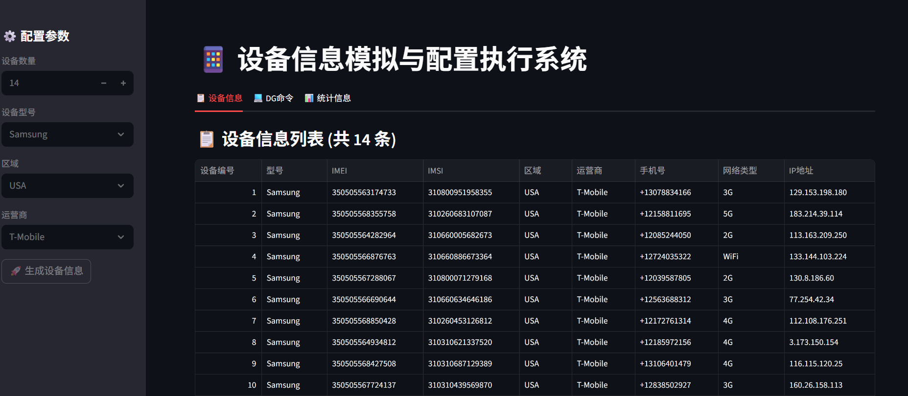

# IMEI Generator Tool

设备信息模拟与配置执行系统


## 项目介绍

这是一个用于生成模拟设备信息并执行相关配置命令的工具系统。可以生成包括IMEI、IMSI、手机号码、MAC地址等在内的完整设备信息，并生成相应的DG命令用于设备模拟。

## 功能特性

1. 批量生成设备信息
2. 支持多种品牌设备（Samsung、Apple、Huawei等）
3. 支持多个国家/地区（中国、美国、港澳台等）
4. 生成完整的DG命令用于设备配置
5. 支持通过SSH执行命令
6. 提供基于Streamlit的图形界面

## 安装依赖

```bash
pip install -e .
```

## 使用方法

### 命令行方式

```bash
# 生成10条默认设备信息
python src/main.py

# 生成指定数量和类型的设备信息
python src/main.py -n 20 -m Samsung -r China -c "China Mobile"

# 生成设备信息并通过SSH执行命令
python src/main.py -n 5 --ssh-host 192.168.1.100 --ssh-port 22 --ssh-username root --ssh-password password
```

### 图形界面方式

```bash
python -m streamlit run src/streamlit_app.py
```

## 参数说明

### 命令行参数

- `-n, --count`: 生成设备信息的数量（默认：10）
- `-m, --model`: 指定设备型号（默认：Samsung）
- `-r, --region`: 指定区域（默认：China）
- `-c, --carrier`: 指定运营商（默认：China Mobile）
- `-o, --output`: 设备信息输出文件名（默认：device_info.json）
- `--ssh-host`: SSH主机地址
- `--ssh-port`: SSH端口（默认：22）
- `--ssh-username`: SSH用户名
- `--ssh-password`: SSH密码
- `--commands-file`: DG命令输出文件名（默认：dg_commands.txt）

### 图形界面操作

1. 在侧边栏配置生成参数
2. 点击"生成设备信息"按钮
3. 在不同标签页查看结果：
   - 设备信息：查看生成的设备信息列表和详细信息
   - DG命令：查看生成的DG命令
   - 统计信息：查看设备信息的统计图表

## 项目结构

```
imei-generator-tool/
├── src/
│   ├── config/
│   │   ├── carrier_info.py      # 运营商信息配置
│   │   └── device_models.py     # 设备型号配置
│   ├── executor/
│   │   ├── dg_command_generator.py  # DG命令生成器
│   │   └── ssh_executor.py      # SSH执行器
│   ├── generator/
│   │   └── device_info_generator.py  # 设备信息生成器
│   ├── main.py                  # 命令行主程序
│   └── streamlit_app.py         # Streamlit界面应用
├── pyproject.toml               # 项目配置文件
└── README.md                   # 说明文档
```

## 依赖库

- Faker: 用于生成模拟数据
- paramiko: 用于SSH连接
- streamlit: 用于创建图形界面
- pandas: 用于数据处理和展示
